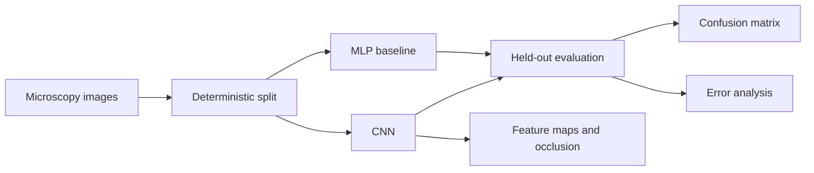

<div align="center">

# Blood Cell Image Classification

**Microscopy classification with model comparison, robustness testing, and visual explanations**

[](https://github.com/Mahdi-Jadidi/blood-cell-image-classification/actions/workflows/ci.yml)


</div>

## Overview

This project classifies blood-cell microscopy images and compares two fundamentally different neural baselines: a fully connected network that sees flattened pixels and a convolutional network that preserves spatial structure. The pipeline then investigates *why* the stronger model works through feature maps, geometric stress tests, error analysis, and occlusion sensitivity.

## Results

| Model | Test accuracy | Interpretation |
|---|---:|---|
| MLP baseline | 91.70% | Strong global pixel baseline, limited spatial inductive bias |
| CNN | **99.00%** | Learns local morphology and generalizes substantially better |

Evaluation used a held-out test set of 1,000 images. The 7.3-point gap supports the core hypothesis: local morphology matters for cell recognition.

## What the project demonstrates

- Fair MLP-versus-CNN comparison under the same deterministic data split.
- Per-class precision, recall, F1, confusion matrix, and misclassification review.
- First-layer activation maps for inspecting learned visual filters.
- Rotation/flip robustness tests and occlusion maps for localizing influential regions.
- Reproducible artifacts rather than notebook-only outputs.

## Pipeline



## Repository layout

```text
src/blood_cell_classifier/
├── config.py             # experiment configuration
├── data.py               # ImageFolder loading and splits
├── models.py             # MLP and CNN definitions
├── training.py           # optimization loop and checkpoints
├── evaluation.py         # metrics and error analysis
├── interpretability.py   # feature maps and occlusion sensitivity
├── pipeline.py           # end-to-end orchestration
└── cli.py                # command-line interface
```

## Quick start

```bash
git clone https://github.com/Mahdi-Jadidi/blood-cell-image-classification.git
cd blood-cell-image-classification
python -m venv .venv
pip install -e .
blood-cell-classifier train --data-dir /path/to/dataset --output-dir outputs
```

The dataset must follow `torchvision.datasets.ImageFolder`: one folder per class. Use `--epochs 80` for the full experiment or `--skip-interpretability` for a training-only run.

## Artifacts

A successful run writes model checkpoints, training histories, classification reports, confusion matrices, error samples, and compressed interpretability arrays to the selected output directory.

## Limitations

The benchmark measures classification under the source dataset's imaging conditions. Before clinical use, external validation is required across laboratories, microscopes, staining protocols, demographic groups, and image-quality levels. This repository is a research implementation, not a diagnostic device.
